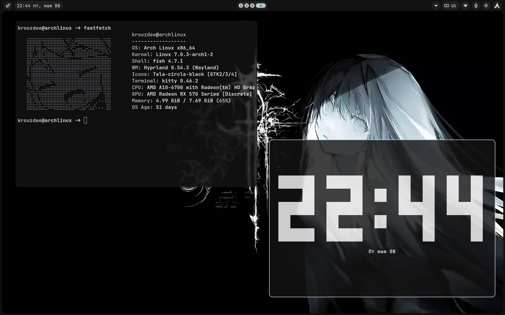

# Hyprland Dotfiles

A clean and functional Hyprland configuration managed with `GNU Stow`. This setup features the **Noctalia Shell**.

---

## 📸 Preview



---

## 🛠 Features

*   **Window Manager:** Hyprland
*   **Shell/Bar/Launcher:** [Noctalia Shell](https://github.com/noctalia-dev/noctalia-shell) 
*   **Terminal:** Kitty
*   **File Manager:** Thunar
*   **Workflow:** Symlink-based management using `stow`.

---

## 📦 Dependencies

Ensure you have the following programs installed:


| Category | Application |
| :--- | :--- |
| **Core** | `hyprland`, `noctalia-shell`, `stow` |
| **Terminal** | `kitty` |
| **GUI Apps** | `thunar`, `firefox`, `vscodium` |
| **Utilities** | `hyprlock`, `hyprpicker`, `hyprshot`, `cliphist`, `wl-clipboard` |

---

## 🚀 Installation

> [!IMPORTANT]
> **Automatic Setup works on Arch Linux only.** The script uses `pacman` and `yay` for package management.

### Option 1: Automatic Setup (Recommended for Arch Users)
This method handles everything: system dependencies, AUR helper (`yay`), and config symlinking.

1. Clone the repository:
   ```bash
   git clone https://github.com/Krouzdee/dotfiles.git
   cd dotfiles
   ```
2. Run the installer:
   ```bash
   chmod +x install.py
   ./install.py
   ```

### Option 2: Manual Setup
If you are on another distribution or want manual control:
1. Manually install the [Dependencies](#-dependencies).
2. Clone the repo and use `stow` (or manually copy configs):
   ```bash
   stow -R .
   ```

## ⌨️ Keybindings

The main modifier key is `SUPER` (Windows key).

### System & Applications
*   `SUPER + T` - Open Kitty (Terminal)
*   `SUPER + Shift + T` - Floating Terminal
*   `SUPER + Q` - Close Active Window
*   `SUPER + E` - Open Thunar (File Manager)
*   `SUPER + W` - Open Firefox
*   `SUPER + B` - Open VSCodium
*   `SUPER + D` - Noctalia App Launcher
*   `SUPER + L` - Lock Screen (Hyprlock)
*   `Ctrl + Alt + Del` — Exit Hyprland

### Window Management
*   `SUPER + Space` - Toggle Floating & Center
*   `SUPER + P` - Pin
*   `SUPER + Arrow Keys` - Move Focus
*   `SUPER + Ctrl + Arrow Keys` - Move Window
*   `SUPER + Shift + Arrow Keys` - Resize Window
*   `SUPER + Shift + F` - Toggle Fullscreen

### Utilities
*   `SUPER + Shift + S` - Screenshot (Region)
*   `SUPER + C` - Color Picker (Hyprpicker)


---

## 🎨 Configuration Structure

The configuration is modular for easy maintenance:
*   `~/.config/hypr/hyprland.conf`: Main entry point.
*   `~/.config/hypr/configs/`: Specific settings (input, animations, etc.).
*   `~/.config/hypr/noctalia/`: Noctalia Shell styling and integration.
*   `~/.config/hypr/colors.conf`: Main color scheme (sourced first).
